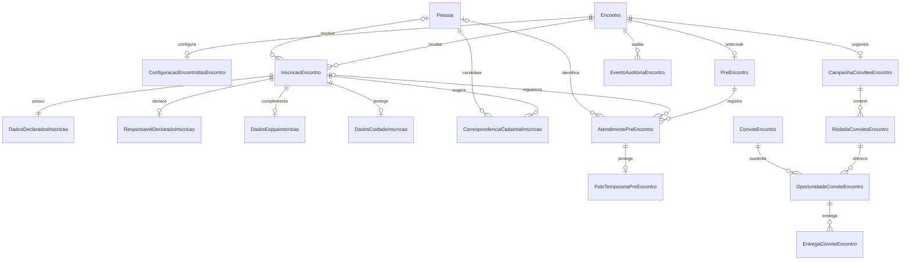

# R.3C.5 — Modelagem técnica de Encontristas

## Status e alcance

Esta modelagem traduz a arquitetura funcional e a ficha pública aprovadas. A
revisão humana R.3C.6 aprovou seu desenho conceitual e fechou as decisões de
produto destacadas neste documento. Ela orienta migrations, services, APIs e
frontend futuros, mas não representa implementação nem congela o schema
Django, nomes finais, URLs ou contratos.

R.3 permanece aberta. Nenhuma estrutura legada é removida nesta etapa.

## Princípios

- expansão antes de cutover;
- PostgreSQL como fonte de verdade;
- default deny e contratos mínimos;
- histórico e auditoria sem registrar conteúdo sensível em logs técnicos;
- idempotência e atomicidade nos comandos;
- nenhuma associação ou atualização cadastral automática;
- nenhuma criação antecipada de `PerfilAlpinista`;
- capacidade real, sem overbooking;
- separação entre inscrição, convite, Pré-Encontro e participação efetiva;
- preservação semântica de `ConviteEncontro` e compatibilidade com D.2–D.5.

## Entidades

| Entidade conceitual | Responsabilidade | Relações e cardinalidade propostas | Estados | Constraints e índices propostos | Sensível | Autoridade de escrita e lifecycle |
|---|---|---|---|---|---|---|
| `ConfiguracaoEncontristasEncontro` | Janela, faixa etária e capacidade | Um-para-um com `Encontro` | Sem estado próprio | um registro por Encontro; capacidade positiva; idades coerentes; abertura anterior ao encerramento | Não | Diretoria/Suporte alteram; Fichas consulta; preservada enquanto houver operação/histórico |
| `InscricaoEncontro` | Inscrição lógica em uma edição | Muitas para um Encontro; zero ou uma Pessoa | `ENVIADA`, `CANCELADA` | unicidade parcial Pessoa/Encontro quando resolvida; índices por Encontro/status/origem, Pessoa/Encontro e envio | Sim | Público cria/edita/cancela na janela; Fichas regulariza; sem deleção operacional |
| `DadosDeclaradosInscricao` | Campos cadastrais estruturados e snapshot atual | Um-para-um com inscrição | Sem estado | uma ficha atual por inscrição; versão de schema positiva | Sim | Público na janela e Fichas após encerramento; atualização não altera Pessoa |
| `ResponsavelDeclaradoInscricao` | Responsável informado para menor | Zero ou um por inscrição | Sem estado | obrigatório por service quando menor; CPF não é único entre inscrições | Sim | Público/Fichas conforme a janela; nunca cria vínculo familiar |
| `DadosCuidadoInscricao` | Conteúdo restrito de cuidado e acolhimento | Zero ou um por inscrição | Sem estado | uma linha por inscrição; validações condicionais no service | Especialmente sensível | Público declara; consulta e conferência obedecem ao Encontro e às policies específicas |
| `DadosEsppaInscricao` | Estado civil, cônjuge ou referência declarados | Zero ou um; permitido somente para ESPPA | Sem estado | coerência cônjuge/referência por service | Sim | Público/Fichas; nunca cria Pessoa ou vínculo canônico |
| `CorrespondenciaCadastralInscricao` | Sugestão e decisão sobre possível Pessoa | Muitas por inscrição; cada uma aponta a uma Pessoa candidata | `SUGERIDA`, `REJEITADA`, `ACEITA` | no máximo uma aceita por inscrição; candidato único por inscrição | Sim | Sistema sugere; Fichas decide; decisão auditável |
| `PreEncontro` | Marco operacional obrigatório anterior ao Encontro | Zero ou um por Encontro na v1 | Sem estado próprio | unicidade por Encontro; data/hora/local coerentes | Não | Fichas/Diretoria/Suporte gerem; integra a Agenda sem ser Preparatória |
| `AtendimentoPreEncontro` | Check-in, presença, vaga, cuidado, pagamento, foto e regularização | Pertence ao Pré; inscrição e Pessoa opcionais | Sem máquina geral; fatos operacionais independentes | ao menos inscrição, Pessoa ou nome informado; unicidades condicionais; índices por Pré, inscrição, Pessoa e regularização | Sim | Fichas/equipe autorizada; nunca apagado ao regularizar |
| `ConferenciaCuidadoPreEncontro` | Registra que os dados de cuidado foram conferidos operacionalmente | Zero ou uma por atendimento; referencia os dados conferidos | Atualizada deterministicamente em nova conferência | atendimento único; ator, instante e marker de atualização obrigatórios | Especialmente sensível | Fichas e Coordenação Geral contextual conferem; Diretoria/Suporte seguem policy global |
| `FotoTemporariaPreEncontro` | Foto protegida antes da resolução da Pessoa | Zero ou uma por atendimento | Pendente de vinculação ou vinculada, se necessário | uma foto ativa por atendimento; storage privado | Sim | Fichas/equipe autorizada; vinculada por service após resolução |
| `CampanhaConvitesEncontro` | Coordena início, prazo, prorrogação e encerramento | Uma por Encontro/finalidade participar | `ATIVA`, `AGUARDANDO_DECISAO`, `ENCERRADA` | uma campanha lógica por Encontro; prazo posterior ao início; timestamps coerentes | Não | Fichas inicia/prorroga/encerra; sistema muda para aguardando decisão no prazo |
| `RodadaConvitesEncontro` | Contexto temporal de oportunidades | Muitas por campanha | `ABERTA`, `ENCERRADA` | número sequencial único por campanha; tipo `INICIAL`, `REPOSICAO` ou `PRORROGACAO` | Não | Service da campanha cria; fechamento não reabre links |
| `OportunidadeConviteEncontro` | Chance específica de resposta em uma rodada | Pertence a rodada e a um `ConviteEncontro` de participação | `PENDENTE`, `CONSUMIDA`, `SUSPENSA`, `EXPIRADA`, `INVALIDADA` | uma oportunidade por convite/rodada; token único seguro; timestamps coerentes; resposta única | Sim | Sistema cria; público responde; Fichas suspende/reabre quando autorizado |
| `EntregaConviteEncontro` | Tentativa de transporte por canal | Muitas por oportunidade, agrupadas por canal/idempotência | `PENDENTE`, `ENVIANDO`, `ENTREGUE`, `FALHOU` | chave idempotente única; tentativas monotônicas; índice para retry | Sim | Worker atualiza; reenvio manual agenda nova tentativa, não novo convite |
| `EventoAuditoriaEncontro` | Trilha estruturada de fatos sensíveis | Muitas por Encontro; ator e objeto afetado | Imutável | índices por Encontro, entidade, objeto e instante; sem update/delete comum | Pode conter diferença sensível | Services gravam atomicamente; leitura restrita |

Os estados conceituais são os mínimos aprovados para distinguir transições de
negócio ou transporte. Seus nomes e campos concretos ainda serão revisados no
schema Django; nada nesta tabela está implementado.

## Relações

- A configuração é a linha estável da operação de encontristas de um Encontro.
- A inscrição pertence diretamente ao Encontro e só depois pode apontar para
  `Pessoa`.
- Dados declarados, responsável, ESPPA e cuidado são componentes da inscrição,
  não extensões automáticas de `Pessoa`.
- A correspondência cadastral registra candidatos e decisões sem substituir o
  vínculo final opcional em `InscricaoEncontro`.
- O atendimento preserva o check-in original mesmo depois de ligado a uma
  inscrição ou Pessoa regularizada.
- Uma campanha contém rodadas; cada rodada contém oportunidades; uma
  oportunidade pode gerar entregas por múltiplos canais.
- A oportunidade referencia o `ConviteEncontro` lógico existente, sem mudar
  sua identidade Pessoa × Encontro × finalidade.

## Inscrição

### Estrutura principal

`InscricaoEncontro` deve conter conceitualmente:

- Encontro obrigatório e protegido;
- Pessoa opcional e protegida;
- origem `PUBLICA` ou `ADMINISTRATIVA`/`FICHAS`;
- status `ENVIADA` ou `CANCELADA`;
- instantes de envio, atualização, cancelamento e reativação, quando ocorrerem;
- atores administrativos das operações realizadas por Fichas;
- identificador técnico estável não sequencial, sem torná-lo por si só uma
  credencial pública.

`ENVIADA` e `CANCELADA` são suficientes para o lifecycle aprovado. Resolução
cadastral, elegibilidade, convite e aptidão não devem virar estados misturados
na inscrição.

### Unicidade lógica

Quando `pessoa_id` estiver preenchido, uma constraint única em
`(encontro_id, pessoa_id)` preserva uma inscrição lógica por Pessoa/Encontro,
inclusive após cancelamento e reativação. Como PostgreSQL aceita múltiplos
nulos, inscrições ainda não resolvidas continuam possíveis.

O service de resolução deve bloquear a inscrição e a Pessoa candidata, buscar
outra inscrição já vinculada ao mesmo par e impedir a associação conflitante.
Ele não faz merge automático: Fichas precisa resolver o conflito, mantendo os
registros declarados e a auditoria.

Antes da resolução, coincidência de CPF declarado não bloqueia nova inscrição:
o valor pode estar incorreto e o formulário público não tem autoridade para
afirmar identidade. O sistema apenas sinaliza possíveis duplicidades a Fichas,
sem auto-merge ou autoassociação. CPF de responsável permanece fora dessa
comparação. Depois da resolução, a unicidade Pessoa × Encontro impede vincular
silenciosamente duas fichas incompatíveis à mesma Pessoa; Fichas precisa tomar
uma decisão explícita preservando ambas as evidências declaradas.

### Elegibilidade

Um service único avalia:

- tipo do Encontro;
- conclusão anterior do mesmo tipo em `ParticipacaoEncontro`;
- data de nascimento declarada ou canônica escolhida para a avaliação;
- primeiro e último `DiaEncontro` do calendário oficial vigente;
- idade mínima e máxima da configuração.

Sem calendário oficial suficiente, o resultado é **não avaliável**. Não há
fallback para `data_referencia` ou data textual legada. Atingir a idade mínima
até o último dia torna a pessoa elegível; se ainda não a atingiu hoje, o
resultado inclui aviso informativo. A idade máxima é aferida no primeiro dia.

Conclusão anterior bloqueia apenas nova participação como encontrista do mesmo
tipo e não interfere em `TrabalhoEncontro`. A regra usa os fatos canônicos já
existentes, sem duplicar constraint de conclusão.

### Reprogramação

O comando canônico de reprogramação deve enfileirar ou executar reconciliação
idempotente de elegibilidade com referência ao calendário anterior e ao novo.

- sem convite: atualiza a avaliação normalmente;
- oportunidade pendente e agora inelegível: torna-a `SUSPENSA` e abre revisão;
- convite confirmado e agora inelegível: preserva confirmação e abre revisão.

A pendência registra motivo `REPROGRAMACAO`, calendários/datas anterior e novo,
resultado anterior e novo e posterior decisão de Fichas. Essa revisão pode ser
uma entidade própria ou um subtipo estruturado da auditoria; a escolha final
depende do desenho de tarefas operacionais.

## Dados declarados

### Separação recomendada

A inscrição não deve se tornar um model monolítico. Recomenda-se:

- `DadosDeclaradosInscricao`: identificação, contatos, endereço, sacramentos,
  origem do contato e campos estruturados usados em busca/comparação;
- `ResponsavelDeclaradoInscricao`: dados exclusivos do responsável;
- `DadosEsppaInscricao`: estado civil, cônjuge ou referência;
- `DadosCuidadoInscricao`: fronteira de autorização mais restrita;
- snapshot JSON atual com `snapshot_schema_version` na ficha declarada.

O snapshot é a representação atual da ficha finalizada, não um histórico de
versões. Edição pública dentro da janela atualiza campos e snapshot na mesma
transação. Não se guardam cópias integrais automáticas de cada edição. Eventos
de edição podem registrar ator, instante e campos alterados sem copiar PII.

Dados estruturados são normalizados para operação e comparação; o snapshot
preserva a representação declarada conforme o contrato daquela versão. Ambos
continuam separados dos valores canônicos de `Pessoa`.

### Resolução cadastral

`CorrespondenciaCadastralInscricao` registra cada Pessoa candidata e a origem
do sinal, sem guardar CPF ou contatos novamente. Sugestões podem ser aceitas ou
rejeitadas por Fichas. A aceitação e o preenchimento de `pessoa_id` ocorrem na
mesma transação e geram auditoria.

Criar nova Pessoa ou aplicar campos seletivos requer comandos explícitos. Cada
campo aplicado deve ser identificável na auditoria, sem alterar o snapshot.
Não existe auto-merge.

## Responsável

O responsável declarado é componente da ficha e não uma `Pessoa` implícita.
Contém nome, CPF, parentesco, telefone/WhatsApp e e-mail opcional.

- é exigido pelo service quando a idade na data da submissão indicar menor de
  18 anos;
- CPF é obrigatório na v1, mas não possui unicidade global;
- pode repetir em inscrições de irmãos;
- nunca participa da correspondência cadastral do participante;
- não cria `ResponsavelPessoa`, `VinculoConjugal` ou outro vínculo canônico.

Participante e responsável devem usar campos e nomes técnicos distintos para
impedir confusão semântica.

## Dados de cuidado

`DadosCuidadoInscricao` deve manter estrutura própria, ligada um-para-um à
inscrição, para permitir queryset, serializer e permission específicos. Deve
comportar alergias, restrições/intolerâncias, medicamentos, horários,
observações, neurodivergência/condição, necessidades de apoio, sensibilidades,
o que ajuda e informações adicionais.

As respostas condicionais são validadas por service/serializer; não se tentam
constraints SQL frágeis para texto relacionado. Esses dados não participam da
elegibilidade automática e podem ser conferidos operacionalmente no Pré.
`ConferenciaCuidadoPreEncontro` persiste esse fato sem copiar o conteúdo
sensível: referencia a linha conferida e guarda ator, instante e o
`atualizado_em` observado. Nova conferência atualiza a mesma linha; o histórico
das ações fica em `EventoAuditoriaEncontro`, que não é fonte do estado
operacional. Ter ou não conferência não altera aptidão.

### Autorização contextual

O coordenador contextual aprovado é qualquer membro da `EquipeEncontro`
canônica **Coordenação Geral** daquele Encontro. O domínio atual sustenta a
cadeia `VinculoUsuarioPessoa` → `Pessoa` → `TrabalhoEncontro` →
`RoleEquipeEncontro` → `EquipeEncontro`; o código canônico da equipe snapshot,
e não seu nome de apresentação, deve identificar Coordenação Geral com
segurança.

Não será criado cadastro paralelo de coordenador temporário. A flag atual
`concede_registro_presenca` autoriza outra finalidade e não será usada como
atalho para cuidado; a policy deriva diretamente do vínculo de trabalho
vigente na Coordenação Geral.

Fichas e integrantes vigentes da Coordenação Geral canônica podem conferir
cuidados no mesmo Encontro. Coordenação de outro Encontro não recebe essa
capacidade. Consulta e conferência continuam operações distintas e sujeitas à
minimização dos dados sensíveis.

O acesso termina em `FINALIZADO` e `CANCELADO`, permanece em `ADIADO` e nunca
se estende a outro Encontro. Fichas, Diretoria e Suporte usam suas capacidades
globais específicas; os demais ficam negados.

## Pré-Encontro

`PreEncontro` é um marco operacional obrigatório, diferente de
`ReuniaoPreparatoriaEncontro`. Ele pertence a um Encontro e contém data,
horário, local e integração projetável na Agenda.

A cardinalidade aprovada para a v1 é zero-ou-um por Encontro: o Encontro pode
ainda não ter Pré configurado, mas nunca terá múltiplos Pré-Encontros nesta
versão. A futura migration deverá materializar essa unicidade.

## Atendimento/check-in

`AtendimentoPreEncontro` registra o fato da chegada e os controles
operacionais. Deve comportar:

- Pré-Encontro obrigatório;
- inscrição e Pessoa opcionais;
- nome informado preservado;
- presença, ator e instante do registro;
- cuidado conferido, com ator e instante;
- pagamento e forma;
- foto realizada/adicionada;
- indicação de regularização pendente;
- observações operacionais;
- resolução de vaga ou pendência de decisão da Diretoria.

O registro pode começar com inscrição confirmada, inscrição sem confirmação
ou sem ficha/Pessoa. Uma check constraint local deve exigir ao menos inscrição,
Pessoa ou nome informado. Constraints parciais evitam duplicar atendimento da
mesma inscrição ou Pessoa no mesmo Pré, sem impedir o caso ainda não resolvido.

Ao regularizar, o service bloqueia o atendimento e os alvos, associa inscrição
e/ou Pessoa e preserva nome, horário e contexto originais. O check-in não é
apagado nem recriado.

### Operação digital

A futura tela precisa consultar e comandar, sem CRUD genérico:

- busca e identificação mínima;
- situação da inscrição e do convite;
- registro de presença;
- conferência de cuidado por contrato separado;
- pagamento e forma;
- captura/associação de foto;
- pendência e conclusão de regularização;
- situação da vaga e aptidão derivada.

## Capacidade e aptidão

Aptidão não deve ser um status livremente editável. Ela é derivada de:

- presença no Pré-Encontro;
- vaga resolvida dentro da capacidade vigente.

Convite confirmado, pagamento, foto e cuidado conferido não são requisitos
absolutos de aptidão. Quem chega sem confirmação ou ficha pode ser regularizado.

Quando o número de presentes elegíveis exceder as vagas disponíveis, todas as
presenças são registradas, mas o sistema não escolhe por ordem de chegada nem
atribui automaticamente a última vaga. Os casos concorrentes ficam na situação
derivada **AGUARDANDO_DECISAO_DIRETORIA**. Diretoria decide quem segue; Suporte
mantém a autoridade já aprovada para alterar capacidade. Um aumento válido
também pode resolver o conflito.

A decisão de vaga precisa ser um fato persistido no atendimento — com ator e
instante — porque explica a aptidão e protege o limite. A aptidão continua
derivada desse fato, sem booleano redundante. O estado de espera pode ser
derivado com segurança da presença, da capacidade e da ausência de decisão;
não precisa obrigatoriamente virar enum.

## Pagamento

Pagamento é controle operacional e não requisito de aptidão. Estados mínimos:

- `PAGO`;
- `NAO_PAGO`.

Quando pago, a forma é `PIX`, `DINHEIRO`, `CARTAO` ou `OUTRO`. O atendimento
registra quem marcou e quando. Não se modelam valor, transação, comprovante,
conciliação ou gateway. `NAO_PAGO` não impede participação.

## Foto

Foto não pertence à ficha pública e é tirada no Pré-Encontro. Para Pessoa
resolvida, o fluxo pode usar a infraestrutura protegida existente por comando
explícito. Sem Pessoa resolvida, a foto permanece privada e arquivada junto à
ficha/atendimento correspondente pelo tempo necessário, sem ser descartada, e
deve poder ser associada ao cadastro canônico após a resolução.

O arquivo nunca deve ser servido por `/media`, e a associação posterior não
pode apagar seu vínculo histórico com o atendimento. O storage/path final
permanece pendente.

## PDFs do Pré-Encontro

Devem existir futuramente dois contratos de exportação separados:

1. **Lista operacional geral:** nome, confirmação, caixas vazias para presença,
   cuidado conferido, pagamento e foto, forma de pagamento, observação e linhas
   para extras. Não contém detalhes sensíveis de cuidado.
2. **USO RESTRITO — CUIDADO E ACOLHIMENTO:** participante, alergias,
   restrições, medicamentos/horários, apoio, sensibilidades, informações
   relevantes e espaço de conferência. A marcação de uso restrito é explícita.

O segundo PDF segue a mesma autorização dos dados de cuidado. Após operação
em papel, Fichas transcreve/confere manualmente no SIA. Não haverá OCR, leitura
de marcações ou importação de escaneado.

Os dois PDFs serão gerados sob demanda e não serão persistidos como publicação
ou arquivo histórico. O restrito exige autorização no momento da geração e do
download. O fluxo não reutiliza automaticamente
`PublicacaoCalendarioInstitucional`; renderer e contrato concretos permanecem
para implementação.

Crachás, número de grupo da Pré e cores do Encontro ficam no backlog e não são
modelados na primeira implementação.

## Configuração e capacidade

`ConfiguracaoEncontristasEncontro` é proposta como one-to-one protegida com
`Encontro` e como linha estável para serialização concorrente. Deve conter
capacidade, idades mínima/máxima e abertura/encerramento das inscrições.

Invariantes locais:

- capacidade maior que zero;
- idades não negativas e mínima menor ou igual à máxima;
- abertura anterior ao encerramento.

Validações dependentes de calendário, ocupação ou lifecycle pertencem aos
services. Diretoria e Suporte alteram; Fichas consulta e opera dentro do
limite. Toda mudança de capacidade registra valores anterior/novo, ator e
instante.

Redução bloqueia a configuração se confirmados ou vagas já atribuídas no Pré
superarem o novo limite. Aumento emite fato idempotente de capacidade reaberta,
permitindo campanha/lista de espera ou atendimentos pendentes avançarem.

## Campanha

`CampanhaConvitesEncontro` pertence ao Encontro para a finalidade participar e
registra início manual, autor, prazo de confirmação, encerramento e
prorrogações. Estados mínimos recomendados:

- `ATIVA`: aceita processamento e respostas válidas;
- `AGUARDANDO_DECISAO`: prazo atingido; links pendentes não confirmam;
- `ENCERRADA`: decisão explícita de Fichas encerrou o fluxo.

Não é necessário estado “não iniciada”: antes da ação manual, a campanha ainda
não existe. Prorrogar parte de `AGUARDANDO_DECISAO`, atualiza o prazo sob
auditoria e cria nova rodada; não revive links antigos.

## Rodadas e oportunidades

### Rodada

`RodadaConvitesEncontro` pertence a uma campanha, possui número sequencial,
tipo `INICIAL`, `REPOSICAO` ou `PRORROGACAO`, abertura e encerramento. Estados
`ABERTA` e `ENCERRADA` bastam. Número é único por campanha e apenas uma rodada
deve estar aberta quando o fluxo exigir disputa pelo mesmo conjunto de vagas.

Nova rodada cria novas oportunidades. Encerrar uma rodada invalida ou expira
as oportunidades conforme a causa; nunca reativa as anteriores.

### Oportunidade

`OportunidadeConviteEncontro` pertence a uma rodada e ao
`ConviteEncontro(PARTICIPAR)`. Os estados recomendados são:

- `PENDENTE`: pode responder se campanha, prazo, elegibilidade e capacidade
  permitirem;
- `CONSUMIDA`: resposta única registrada;
- `SUSPENSA`: bloqueio potencialmente reversível, como revisão por
  reprogramação;
- `EXPIRADA`: validade temporal terminou;
- `INVALIDADA`: perdeu validade por encerramento, vaga ocupada ou ação
  administrativa definitiva.

As distinções são operacionais: suspensão admite revisão; expiração explica o
tempo; invalidação encerra por outro fato; consumo preserva a resposta.

O fluxo público valida token e data de nascimento e, em uma transação, bloqueia
oportunidade, convite e configuração, revalida condições, consome a
oportunidade e atualiza o `ConviteEncontro`. Recusa explícita impede reenvio
automático; reabertura exige comando auditado de Fichas.

## Entregas

`EntregaConviteEncontro` é separada da oportunidade e representa EMAIL ou
WHATSAPP. Uma oportunidade pode ter ambos. Campos conceituais:

- canal e status;
- contador de tentativas;
- criado, primeira/última tentativa, entregue e próximo retry;
- erro técnico sanitizado e código classificável;
- chave de idempotência.

Estados mínimos: `PENDENTE`, `ENVIANDO`, `ENTREGUE`, `FALHOU`. Retry reutiliza
a entrega lógica/canal ou cria tentativa filha conforme desenho posterior, mas
nunca cria novo convite. Estado de transporte não altera o estado lógico do
convite; falha total abre pendência para Fichas e não bloqueia a campanha.

Adapters:

- e-mail: Mailpit/SMTP local em desenvolvimento e SMTP institucional futuro;
- WhatsApp: mock com sucesso/falha em desenvolvimento e provider futuro ainda
  não escolhido.

Nenhuma credencial, segredo de provider ou token público pertence à entrega.

## Lista de espera

Recomenda-se lista de espera como **projeção derivada**, não entidade ou fila
priorizada: inscrições enviadas, elegíveis, não confirmadas e ainda aptas a
receber oportunidade quando a capacidade está cheia.

Estados persistidos de inscrição, convite, oportunidade, elegibilidade e
campanha tornam a projeção explicável. Rodadas persistem quem efetivamente
recebeu oportunidade. Isso evita prioridade artificial e duplicação de estado.

Quando uma vaga reabre, uma nova rodada cria oportunidades para todas as
pessoas elegíveis da projeção. A primeira confirmação válida ocupa a vaga; as
demais oportunidades são invalidadas para aquela disputa e as inscrições
continuam projetadas na espera quando ainda elegíveis.

## Concorrência

`ConfiguracaoEncontristasEncontro` é o melhor lock agregado porque existe uma
linha por Encontro e a capacidade pertence a ela. Bloquear apenas campanha não
cobre check-in; bloquear apenas Encontro mistura responsabilidades e aumenta
contenção sobre outros comandos.

Confirmação futura:

1. `transaction.atomic`;
2. `select_for_update` na configuração;
3. locks em oportunidade e convite em ordem estável;
4. revalidação de prazo, elegibilidade, status e ocupação;
5. confirmação do convite e consumo da oportunidade;
6. invalidação das oportunidades concorrentes quando a vaga final for tomada;
7. `IntegrityError` traduzido em erro de domínio.

Resolução de vaga no Pré usa o mesmo lock da configuração e bloqueia os
atendimentos envolvidos. O check-in isolado registra presença, mas não decide
uma disputa. Diretoria resolve os concorrentes dentro da transação, e redução
de capacidade usa a mesma linha. Assim, não há escolha por ordem de chegada
nem estado acima do limite.

Constraints complementam os locks: unicidades de inscrição resolvida,
convite existente, oportunidade/rodada, chaves idempotentes e atribuição de
vaga. Elas não substituem a contagem transacional.

## Processamento assíncrono

- PostgreSQL guarda campanha, oportunidades, entregas e estado de verdade.
- Redis transporta tarefas; não guarda estado de negócio autoritativo.
- Celery Worker cria/processa entregas, retries e reconciliações idempotentes.
- Celery Beat agenda prazos, retries vencidos e reconciliação temporal sem
  polling agressivo.

Eventos conceituais internos: campanha iniciada, rodada criada, convite a
entregar, retry vencido, prazo encerrado, capacidade reaberta e reprogramação.
Eles podem ser tarefas transacionais/outbox simples; não se recomenda event bus
novo. O mecanismo exato de publicação confiável permanece para implementação.

Idempotência combina:

- chaves determinísticas por comando/tarefa;
- unique constraints;
- locks e transações;
- tasks que relêem o estado antes de agir;
- `IntegrityError` convertido em resultado idempotente ou conflito de domínio.

## Auditoria

Recomenda-se uma entidade dedicada `EventoAuditoriaEncontro`, porque o
`LogSistema` atual é textual e não representa objeto, valores anterior/novo ou
justificativa de forma consultável. A combinação mais compatível é:

- auditoria dedicada, imutável e gravada na mesma transação do comando;
- `LogSistema` opcional apenas para resumo operacional por identificadores.

Campos conceituais: ator, instante, Encontro, entidade/fato, tipo e ID do
objeto, valores anterior e novo estruturados e justificativa. Justificativa é
obrigatória para correções pós-`FINALIZADO` de participação e
`TrabalhoEncontro`/equipe. Mudança de capacidade sempre é auditada, mas sua
justificativa não é obrigatória até decisão contrária. Foto posterior não a
exige.

Valores sensíveis devem ser minimizados ou representados por nomes de campos e
indicadores de alteração. A auditoria não é autorização para duplicar saúde,
CPF ou tokens.

## Privacidade

- Serializers usam allowlists distintas para público, operação e cuidado.
- Querysets de cuidado exigem escopo explícito de Encontro.
- Logs e erros nunca registram CPF, saúde, medicamento, telefone, e-mail,
  token ou ficha integral.
- Erros técnicos de entrega são sanitizados e não incluem payload/provider
  credential.
- Tokens são armazenados de forma segura, preferencialmente por digest, nunca
  em logs; implementação criptográfica fica pendente.
- PDFs restritos usam entrega autenticada e não são publicados por `/media`.
- Busca genérica, Calendário, Agenda, MME, equipe e relatórios gerais não
  recebem dados de cuidado.

## APIs futuras

Sem fixar URLs, a implementação deverá oferecer comandos/consultas explícitos.

### Público

- ler informações mínimas do Encontro e disponibilidade da janela;
- enviar inscrição;
- recuperar, editar, cancelar e reativar futuramente por mecanismo seguro;
- abrir oportunidade com exposição mínima;
- validar data de nascimento e confirmar ou recusar convite.

### Interno

- consultar/alterar configuração e capacidade conforme autorização;
- listar inscrições, elegibilidade e pendências;
- comparar e resolver cadastro;
- iniciar, prorrogar e encerrar campanha;
- consultar rodadas, oportunidades, entregas e falhas;
- reenviar entrega por comando;
- gerir Pré-Encontro e registrar/regularizar atendimento;
- atribuir vaga/recalcular aptidão;
- registrar pagamento e foto;
- consultar/conferir dados de cuidado por capability própria;
- gerar os dois documentos do Pré;
- consultar auditoria autorizada.

Não haverá endpoint genérico. A fronteira interna continua no BFF autenticado
e sua allowlist explícita. Inscrição e convite públicos usam BFF/superfície
mínima própria, sem liberar `/api/*`, sem JWT no browser e preservando
CSRF/Origin onde aplicável.

## Cutover

1. Criar estruturas novas por migrations expansivas futuras.
2. Manter `Inscricao` e frontend legado inicialmente.
3. Introduzir `InscricaoEncontro` e ficha pública sem backfill heurístico.
4. Envolver o `ConviteEncontro` existente com campanha, rodada, oportunidade e
   entrega, sem alterar sua semântica.
5. Validar fluxos, concorrência, autorização, privacidade e operação real.
6. Fazer cutover de frontend/contratos de forma explícita.
7. Remover legado somente em etapa posterior aprovada.

## Diagrama

## Decisões

### A. Decisões já fechadas

- inscrição por Encontro, pública ou administrativa, sem autoassociação;
- estados mínimos `ENVIADA` e `CANCELADA` e reativação sem duplicação;
- abordagem híbrida de dados estruturados e snapshot atual;
- responsável obrigatório para menor, com CPF distinto do participante;
- dados de cuidado separados e não excludentes;
- Pré-Encontro obrigatório, distinto de Preparatória/participação e com
  cardinalidade zero-ou-um por Encontro na v1;
- presença sem ficha é válida para posterior regularização;
- pagamento, foto e confirmação prévia não bloqueiam aptidão;
- capacidade é limite real;
- disputa excepcional de vaga não usa ordem de chegada e é decidida pela
  Diretoria;
- coordenação contextual deriva do trabalho na Equipe Coordenação Geral, sem
  cadastro paralelo;
- PDFs do Pré são gerados sob demanda e não persistidos como publicação;
- foto sem Pessoa resolvida permanece privada junto à ficha até associação;
- CPF coincidente antes da resolução apenas sinaliza possível duplicidade;
- campanha manual, rodadas, oportunidades e entregas separadas;
- `ConviteEncontro` preserva sua semântica;
- PostgreSQL/Redis/Celery/Beat como direção arquitetural;
- dois PDFs separados, sendo o de cuidado restrito;
- auditoria de correções históricas e capacidade;
- expansão e cutover posterior.

### B. Recomendações técnicas

- configuração one-to-one como lock agregado de capacidade;
- inscrição modular com componentes one-to-one e snapshot JSON atual;
- unique parcial Pessoa/Encontro após resolução;
- correspondências cadastrais persistidas e decididas por Fichas;
- atendimento durável, associável depois sem perder o check-in original;
- vaga atribuída como fato persistido e aptidão derivada;
- lista de espera como projeção, com rodadas/oportunidades persistidas;
- estados mínimos justificados para campanha, rodada, oportunidade e entrega;
- cadeia atual de identidade/trabalho/equipe como base do contexto de cuidado;
- auditoria dedicada combinada com log operacional resumido;
- geração autenticada sob demanda para os PDFs.

### C. Pendências técnicas antes da implementação

- nomenclatura final das entidades e estados propostos;
- comportamento exato da pendência de revisão por reprogramação;
- schema Django definitivo;
- storage/path final da foto;
- renderer dos PDFs;
- desenho final do mecanismo de token e rate limit;
- mecanismo de publicação confiável de tasks;
- detalhes finais de auditoria, locks e constraints;
- contratos finais das APIs;
- provider real de WhatsApp e SMTP institucional definitivo;
- detalhes operacionais de Celery/Redis;
- divisão dos blocos de implementação.

## Pendências

Continuam pendentes somente as definições técnicas listadas acima e as já
registradas na ficha para implementação: URL pública, antiabuso,
máscaras/CEP, consentimentos, schema concreto e contratos de API/BFF.

Nenhuma pendência autoriza implementação antecipada.
